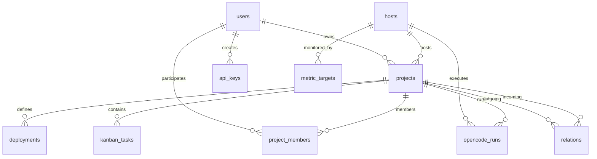

# Project Visor Core Architecture

This document provides a deep dive into the architectural principles, data flow, database models, and internal systems of **Project Visor Core**.

---

## 1. Architectural Philosophy

Project Visor Core is designed around five core principles:
1. **Self-Contained & Zero External Dependencies**: Runs as a single process with embedded SQLite (`@libsql/client` + `drizzle-orm`). No mandatory cloud dependencies or proprietary SaaS services required.
2. **First-Class Infrastructure Mapping**: Physical servers, homelab machines, and cloud VPS are managed alongside projects, enabling real-time conflict detection and execution context binding.
3. **Container-Aware Service Model**: Applications are modeled as sets of typed containers (`web`, `api`, `database`, `cache`, `worker`, etc.) with explicit port mappings and protocol definitions.
4. **Resilient OpenCode Server Integration**: Directly orchestrates code tasks against remote OpenCode Server instances over HTTP/HTTPS with automatic recovery from Cloudflare 524 proxy timeouts.
5. **Pluggable & Extensible Design**: Core exposes slot interfaces (`actionSlot`, `headerActionSlot`, `bannerSlot`, `extraNavItems`) and event hooks (`NotificationProvider`) to easily layer custom or commercial capabilities on top without duplicating code.

---

## 2. High-Level System Architecture

```
┌─────────────────────────────────────────────────────────────┐
│                 Client Layer (Browser / Agents)             │
└──────────────┬───────────────────────────────┬──────────────┘
               │ HTTP / JSON API               │ Bearer pv_live_*
┌──────────────▼───────────────────────────────▼──────────────┐
│                    Next.js App Router Core                  │
│                                                             │
│  ┌────────────────┐  ┌────────────────┐  ┌───────────────┐  │
│  │ Authenticate   │  │ RBAC / Scopes  │  │ Activity Logs │  │
│  │ (JWT / Bcrypt) │  │ Guard          │  │ Dispatcher    │  │
│  └───────┬────────┘  └───────┬────────┘  └───────┬───────┘  │
│          │                   │                   │          │
│  ┌───────▼───────────────────▼───────────────────▼───────┐  │
│  │               Business Logic Services                 │  │
│  │  - containers.ts (Port conflict detection)            │  │
│  │  - opencode.ts   (OpenCode client & 524 recovery)     │  │
│  │  - notifications.ts (NotificationProvider event bus)  │  │
│  └───────────────────────────┬───────────────────────────┘  │
│                              │                              │
│  ┌───────────────────────────▼───────────────────────────┐  │
│  │                Drizzle ORM & SQLite Client            │  │
│  │                data/visor.db (WAL Mode)               │  │
│  └───────────────────────────────────────────────────────┘  │
└──────────────────────────────┬──────────────────────────────┘
                               │
               ┌───────────────┴───────────────┐
               │ Remote OpenCode Server API    │
               │ HTTP/S (Ports 443 / 4096)     │
               └───────────────────────────────┘
```

---

## 3. Database Schema (`src/db/schema.ts`)

Visor Core utilizes SQLite with WAL (Write-Ahead Logging) for high-performance concurrent reads and safe writes.

### Entity Relationship Diagram (ERD)



### Table Definitions:

1. **`users`**:
   - `id` (PK, text): e.g. `usr_...`
   - `username` (text, unique)
   - `password_hash` (text, bcrypt)
   - `role` (text): `'admin' | 'viewer'`
   - `created_at` (integer, epoch timestamp)
2. **`hosts`**:
   - `id` (PK, text): e.g. `host_...`
   - `name`, `ip_address`, `ssh_alias`, `ssh_user`, `ssh_port`
   - `provider`, `os_type`, `specs`, `status` (`online | degraded | offline`)
   - `opencode_enabled`, `opencode_host`, `opencode_port`, `opencode_use_https`, `opencode_username`, `opencode_password`
3. **`projects`**:
   - `id` (PK, text): e.g. `proj_...`
   - `owner_id` (FK -> users.id)
   - `slug`, `title`, `description`, `category` (`websites | bots | crm | api | saas | scripts | idea`)
   - `status` (`idea | backlog | in_dev | staging | production | paused | archived`)
   - `priority` (`low | medium | high | urgent`)
   - `host_id` (FK -> hosts.id, nullable)
   - `repo_url`, `public_url`, `tags` (JSON string array)
   - `readme_notes` (Markdown text)
4. **`deployments`**:
   - `id` (PK, text)
   - `project_id` (FK -> projects.id, unique)
   - `runtime_type` (`docker_compose | docker | pm2 | systemd | static_nginx | serverless`)
   - `container_name`, `internal_port`, `containers` (JSON array of `ProjectContainer`)
   - `deploy_path`, `deploy_command`, `env_keys_hint`
5. **`kanban_tasks`**:
   - `id` (PK, text)
   - `project_id` (FK -> projects.id)
   - `title`, `description`, `priority`
   - `column` (`backlog | todo | in_progress | review | done`)
   - `last_run_id` (FK -> opencode_runs.id)
6. **`relations`**:
   - `id` (PK, text)
   - `source_id` (FK -> projects.id), `target_id` (FK -> projects.id)
   - `relation_type` (`depends_on | api_calls | database_shared | webhook_events | auth_provider | submodule`)
   - `label`, `port`
7. **`api_keys`**:
   - `id` (PK, text), `user_id` (FK -> users.id)
   - `key_hash` (SHA-256), `key_prefix` (e.g. `pv_live_1234`)
   - `role_scope` (`all_projects | scoped_projects`), `allowed_project_ids` (JSON array)
   - `can_write_kanban`, `can_update_status`, `can_view_infra` (boolean flags)
8. **`opencode_runs`**:
   - `id` (PK, text)
   - `project_id` (FK -> projects.id), `host_id` (FK -> hosts.id)
   - `task_id` (FK -> kanban_tasks.id), `session_id`, `model`, `prompt`
   - `status` (`pending | running | completed | failed | timeout`)
   - `git_diff`, `logs`, `error_message`, `execution_time_ms`

---

## 4. Multi-Container & Port Conflict Detection Algorithm

In modern development, a single project frequently contains multiple distinct containers (e.g., Next.js frontend on 3000, Python FastAPI on 8000, Postgres on 5432, Redis on 6379).

### Conflict Detection Mechanism (`src/lib/containers.ts`):
1. **Normalization**: Whenever a project deployment is loaded or updated, `normalizeContainers(deployment)` extracts all active containers and their declared host ports.
2. **Host-Level Aggregation**: For a given `hostId`, `detectHostPortConflicts(hostId, currentProjectId, currentContainers)`:
   - Queries all projects assigned to that host.
   - Collects all ports claimed across every container on every hosted project.
   - Detects any port numbers mapped more than once on the same host across different projects.
3. **Conflict Reporting**: Returns a structured report:
   ```ts
   interface PortConflict {
     port: number;
     protocol: 'http' | 'tcp' | 'udp' | ...;
     conflictingProjects: Array<{ projectId: string; projectTitle: string; containerName: string }>;
   }
   ```
4. **UI Integration**: `ContainerCards.tsx` immediately renders warning badges on the conflicting port inputs in real time.

---

## 5. OpenCode Server Integration & Resilience

OpenCode Server allows autonomous or semi-autonomous execution of coding tasks directly within the remote host's filesystem.

### Protocol Flow:
1. **Discovery**: `GET /api/hosts/[id]/opencode/models` connects to `{host.opencodeHost}:{port}/models` with HTTP Basic Auth and retrieves all supported LLM models.
2. **Session Creation**: When a task is executed, a new or existing session is opened with the target workspace directory (e.g. `/home/docker/my-project`).
3. **Execution**: The prompt is sent to `/sessions/{id}/prompt`.
4. **Cloudflare 524 Timeout Recovery**:
   - If a proxy terminates the connection after 120 seconds with HTTP status 524, Visor Core does NOT mark the task as failed.
   - Visor enters recovery mode, polling `/sessions/{sessionId}/messages` until the model finishes execution.
5. **Diff Extraction**: Visor retrieves the resulting Git diff and renders it with syntax coloring.

---

## 6. Authentication & RBAC Layer

Visor Core supports dual-mode authentication via `authenticateRequest(req)`:
1. **User Session (Web UI)**:
   - Secure HttpOnly JWT cookie signed with `JWT_SECRET`.
   - Admin users have full platform access (`isAdmin: true`).
   - Project members have scoped rights based on their `project_members` role (`viewer` or `editor`).
2. **Bearer API Tokens (Agents & CI/CD)**:
   - Header: `Authorization: Bearer pv_live_<token>`.
   - Looked up via SHA-256 hash in `api_keys`.
   - Enforces granular capabilities (`canWriteKanban`, `canUpdateStatus`, `canViewInfra`) and scoped project IDs.
